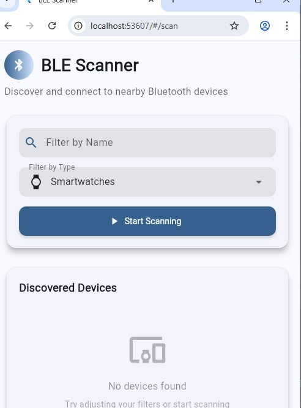
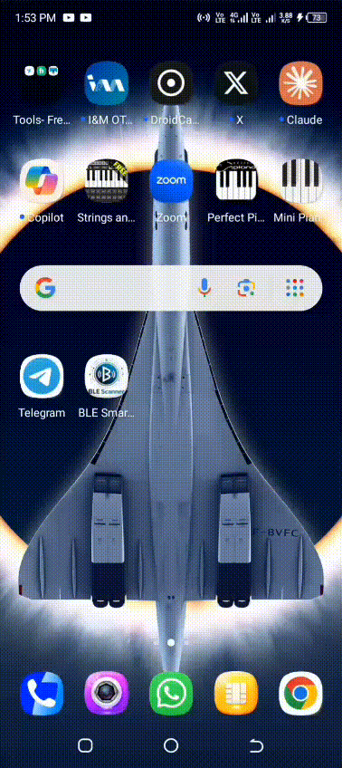

<!-- HEADER -->
<h1 align="center">
  
  <br>
  BLE Smart Device Scanner
</h1>

<p align="center">
  <b>A modern Flutter app for scanning, connecting, and managing Bluetooth Low Energy (BLE) devices.</b><br>
  Built with ❤️ by <a href="https://github.com/graham218">Graham Bill</a>  
</p>

<p align="center">
  
  
  
</p>

---

## ✨ Overview

🚀 **BLE Smart Device Scanner** is a beautifully crafted Flutter application that enables you to **discover**, **connect**, and **interact** with Bluetooth Low Energy (BLE) devices around you — from smartwatches to audio peripherals.

It features smooth animations, a Material 3 design system, and robust error handling — ensuring a seamless and responsive experience across all device sizes.

---

## 🧭 Features

<div align="center">

| 🧩 Core Feature | 💡 Description |
|-----------------|----------------|
| 🔍 **Real-time BLE Scanning** | Discover nearby BLE devices with instant updates. |
| 🏷️ **Device Details** | View device name, ID, RSSI, and manufacturer data. |
| 🧠 **Smart Filtering** | Filter by name or type (Audio Devices, Smartwatches, etc.). |
| 🔗 **Connection Handling** | Connect to and explore device services & characteristics. |
| 🔁 **Auto-Reconnect** | Reconnect automatically up to 2 times on disconnection. |
| 📱 **Responsive Design** | Works beautifully on phones, tablets, and desktops. |

</div>

---

## 🛠️ Tech Stack

<p align="center">
  
  
  
  
  
</p>

---

## ⚙️ Setup Instructions

### 1️⃣ Prerequisites
- 🧰 **Flutter SDK 3.24.3+**
- 📱 **Physical Android/iOS device** (emulators may not support BLE)
- 🔋 **Bluetooth enabled**

### 2️⃣ Installation Steps
```bash
# Clone the repository
git clone https://github.com/graham218/embed_labs.git

# Navigate to the project
cd embed_labs/ble_smart_device_scanner

# Get dependencies
flutter pub get

# Run the app
flutter run
```

### 3️⃣ Configure Permissions

#### 🟩 Android:
Add permissions in `android/app/src/main/AndroidManifest.xml`:
```xml
<uses-permission android:name="android.permission.BLUETOOTH_SCAN"/>
<uses-permission android:name="android.permission.BLUETOOTH_CONNECT"/>
<uses-permission android:name="android.permission.ACCESS_FINE_LOCATION"/>
```

#### 🍎 iOS:
Add the following to `ios/Runner/Info.plist`:
```xml
<key>NSBluetoothAlwaysUsageDescription</key>
<string>This app uses Bluetooth to connect to nearby devices.</string>
<key>NSLocationWhenInUseUsageDescription</key>
<string>Location access is needed to scan for nearby BLE devices.</string>
```

---

## 📲 Download APK

<p align="center">
  <a href="./apk/app-release.apk" download>
    
  </a>
</p>

---

## 📸 Screenshots

<p align="center">
  
  <br>
  <em>Clean, elegant, and responsive interface across devices.</em>
</p>

---

## 🎞️ Demo GIFs

<div align="center">

### 🧱 Pre-format UI


### 🎨 Post-format UI


### ⚙️ Max Web Plus Code


</div>

---

## 🧠 State Management

> Powered by **Riverpod** for structured and reactive state updates.

- **`ScanProvider`** handles BLE scanning streams.
- **`DeviceProvider`** manages connections and device services.
- Each layer is modular and reusable — ideal for scaling IoT-based Flutter apps.

---

## 🧩 Challenges & Solutions

| Challenge | Solution |
|------------|-----------|
| 🧱 Android 12+ Bluetooth permissions | Used `permission_handler` with user-friendly prompts. |
| ⚡ Real-time updates | Leveraged `StreamBuilder` for BLE scan/connection streams. |
| 💻 Screen Responsiveness | `LayoutBuilder` adapts to mobile, tablet, and desktop screens. |
| 🏭 Manufacturer details | Integrated `Device Information Service` for metadata. |
| 🔁 Auto Reconnect | Implemented retry logic with safe fallback on failure. |

---

## 📂 Project Structure

```
ble_smart_device_scanner/
│
├── lib/
│   ├── models/              # BLE device data models
│   ├── providers/           # Riverpod state providers
│   ├── screens/             # App screens (Scan, Device Details)
│   ├── widgets/             # Reusable UI components
│   └── main.dart            # Entry point
│
├── android/                 # Android-specific config
├── ios/                     # iOS-specific config
├── apk/                     # Contains app-release.apk
├── assets/shots/            # Screenshots and demo GIFs
└── pubspec.yaml             # Dependencies & metadata
```

---

## 📞 Contact

<div align="center">

💬 **Developed by:** [Graham Bill](https://github.com/graham218)  
📧 **Email:** [grahambill011@gmail.com](mailto:grahambill011@gmail.com)  
📱 **Phone:** +254 790 613 916  
💻 **GitHub:** [github.com/graham218](https://github.com/graham218)

</div>

---

## 🌟 Contribute
Want to improve this project? Fork it, make changes, and create a pull request!  
Contributions are always welcome 🙌

```bash
# Fork the repo
git clone https://github.com/graham218/embed_labs.git
# Create a feature branch
git checkout -b feature/amazing-update
# Commit changes
git commit -m "Added new feature"
# Push
git push origin feature/amazing-update
```

---

## 🪪 License
This project is licensed under the [MIT License](LICENSE).

---

<p align="center">
  
  <br><br>
  <b>BLE Smart Device Scanner</b> — Built with Flutter 💙
</p>
